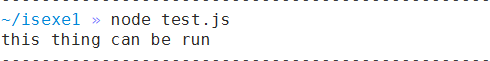

# isexe模块解读
1. 项目功能：检查文件是 是否可执行的
    * 当文件有执行权限时，输出“this things can be run”.
    - 当文件找不到时输出“probably file does not exist or something”。
    - 当文件没有执行权限，但存在时输出“cannot be run”
    - 运行截图

    
    
2. 项目类型：第三方模块
3. 项目入口文件：index.js
4. 项目依赖项：
    - mkdirp:递归创建目录
    - rimraf:删除文件和文件夹，不管文件文件夹是否为空都可以删除
    - tap:测试模块
5. 项目中的代码模块：
    1.  isexe(path,options,cb)
    2.  sync(path,options)
6. 数据结构种类
    1. 字符串：类型判断、值判断、截取赋值
    2. 对象
7. 仓库的根目录有哪些文件？

> README.md:对项目作描述和说明
 
> test文件夹包含basic.js测试文件

> LICENSE:文件统一用的MIT共享协议

> .gitnore:用来排除不必要的项目文件或敏感信息文件，在此文件中写入的文件不会被提交到远程仓库

> index.js:项目主文件，也是项目的入口文件，其中暴露的函数作为第三方模块引用

> mode.js:当宿主环境为linux时项目主文件中引用的文件

> window.js：当宿主环境为windows时项目主文件中引用的文件

> Package.json:存储工程的元数据，描述项目的依赖项，类似配置文件。
    
8. 我们对项目代码进行了拆解，原因是不明白是暴露了函数还是模块
    
```
    module.exports = isexe
    isexe.sync = sync
```
9. 读不懂的代码
```
    core(path, options || {}, function (er, is) {
    if (er) {
      if (er.code === 'EACCES' || options && options.ignoreErrors) {
        er = null
        is = false
      }
    }
    cb(er, is)
  })
}
```
10. 代码中没有bug
11. 代码中我们为你认为没有可以改进的地方
